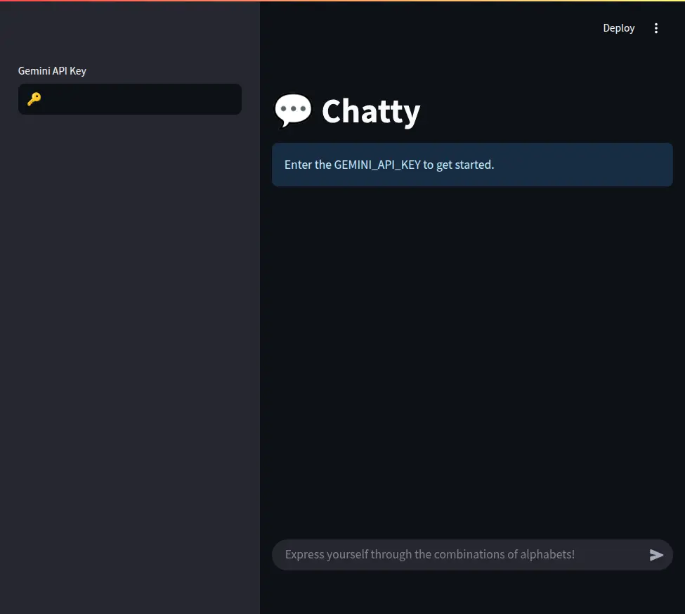
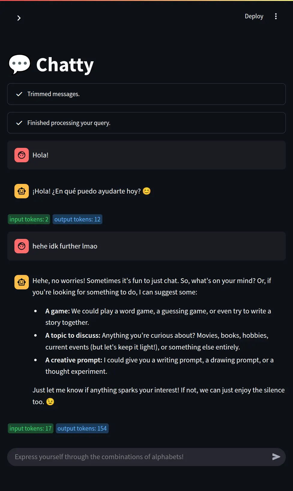
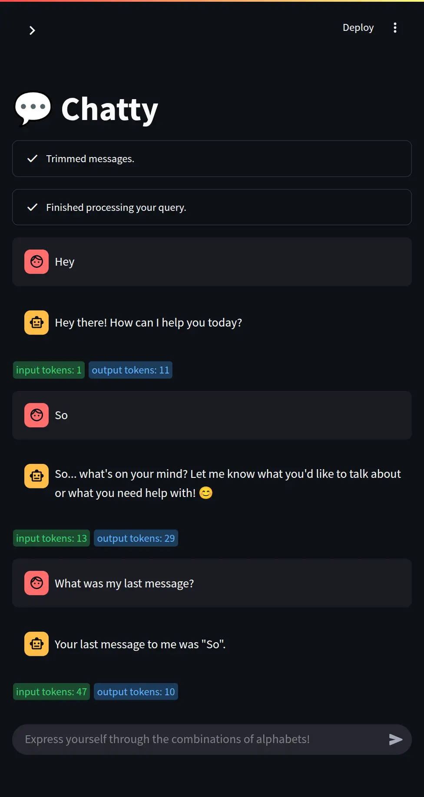

# Chatty 💬

**Chatty** an interactive chatbot built with [Streamlit](https://streamlit.io) and [Langchain](https://www.langchain.com) that supports conversational context.

### App Name Story

One of my Scottish cousin used to say chatty/chatterbox so while looking for a name that aligns with the context of chat bot project I thought of going with it.

## LLM Spec 🤖

**name:** gemini-2.0-flash

**max tokens:** 200

## Steps to Run 🏃

1. Get a Gemini API key from [here](https://ai.google.dev/gemini-api/docs/api-key) (I chose Gemini as it was free)

2. Install [uv](https://docs.astral.sh/uv/getting-started/installation) (by this time most of the python devs should have this already)

3. Open terminal then type `uv run invoke run` and enter

4. Enter the API Key in the sidebar to start chatting.

### Even Easier?

1. Visit https://colab.research.google.com/github/kurtnettle/chatty/blob/main/app.ipynb
2. Click `Runtime>Run All` or press `CTRL+F9`

## Screenshot 📷

<table cellspacing="0" cellpadding="0">
  <tr style="border:none">
    <td style="border:none">
      
    </td>
  </tr>
  <tr>
    <td style="border:none">
      
    </td>
  </tr>
  <tr>
    <td style="border:none">
      
    </td>
  </tr>
</table>

## Repo is archived 📂

**TLDR:** This was just a task given by my faculty and I don't have any plans to continue the support or improvement of this app.

This was a project given by my faculty when I asked him to consider the late submission of assignment. I am grateful he gave a project like this. I was unfamiliar with this tech and have never worked earlier (even i wasn't aware of the package name streamlit and langchain!). In the commitment of learning a new tech, I can proudly say I haven't took help of AI while doing this project.

## License 📜

This project is licensed under the **GNU General Public License v3.0 (GPLv3)**. See
the [LICENSE](LICENSE) file for full details.

By contributing, you acknowledge that your submissions will also be licensed under **GPLv3**.

